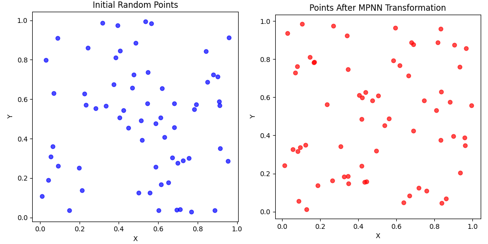
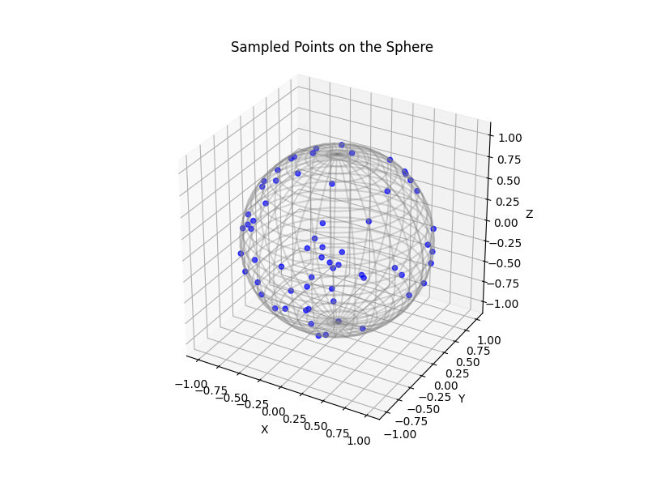

# Message-Passing Monte Carlo

<p align="center">

</p>
<p align="center">

</p>
<p align="center">


</p>

### Requirements

Main dependencies (with python >= 3.7):<br />
torch==1.9.0<br />
torch-cluster==1.5.9<br />
torch-geometric==2.0.3<br />
torch-scatter==2.0.9<br />
torch-sparse==0.6.12<br />
torch-spline-conv==1.2.1<br />

Commands to install all the dependencies in a new conda environment <br />
*(python 3.7 and cuda 10.2 -- for other cuda versions change accordingly)*
```
conda create --name mpmc python=3.7
conda activate mpmc

pip install torch==1.9.0
pip install numpy

pip install torch-scatter -f https://pytorch-geometric.com/whl/torch-1.9.0+cu102.html
pip install torch-sparse -f https://pytorch-geometric.com/whl/torch-1.9.0+cu102.html
pip install torch-cluster -f https://pytorch-geometric.com/whl/torch-1.9.0+cu102.html
pip install torch-spline-conv -f https://pytorch-geometric.com/whl/torch-1.9.0+cu102.html
pip install torch-geometric
```
Alternatively, if one prefers conda, all pytorch geometric dependencies can be installed via
```
conda install pyg -c pyg
```
More details can be found on the pytorch geometric website: https://pytorch-geometric.readthedocs.io/en/latest/
### Run the experiments
To train MPMC, simply run
```
python run_train.py --kwargs
```
where kwargs are specified in `run_train.py` file.

# Usage tips
* **Runtime**: Runtime is greatly dependent on --epochs (in combination with
--start_reduce). For smaller number of points, 
both could probably be reduced by at least a factor of 5-10.
* **Higher dimensions:** The L2-discrepancy approach tends to break down around dimension 6. 
For higher dimensions, we recommend using the approximated Hickernell discrepancy. Note that this requires one
to choose specific dimensionalities of projections to emphasize during training. 
From our experience, setting --dim_emphasize=[1,2,3] often 
provides good results for most applications with low effective dimensionality.
* **L2-discrepancy vs star-discrepancy:** Our method minimizes L2-discrepancy, not star-discrepancy. However, if 
you aim to achieve low star-discrepancy, consider early stopping based on star-discrepancy 
while still training with L2-discrepancy.
* **fine-tuning:** For optimal results, we encourage fine-tuning the 
hyperparameters in the `run_train.py` file.

